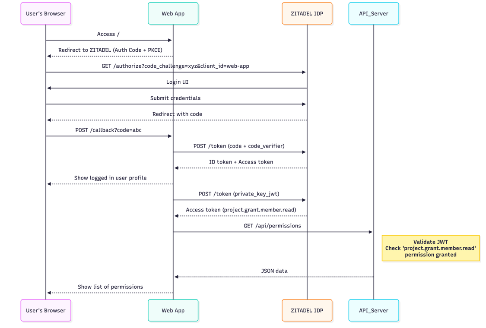

# Zentinl

Zentinl demonstrates performing user authentication based on OIDC standard using ZITADEL Identity Cloud in a web application, 
followed by consuming a protected API endpoint. (This is an extracted version from the [ZITADEL examples](https://github.com/zitadel/zitadel-go/tree/next/example)

## Overview


Web application serves as a front end for the users and has a backend to interact with the ZITADEL Identity Cloud and other required APIs.
The API provides a protected resource that requires authorization with `project.grant.member.read` permission. This is enforced at API itself 
by checking the JWT token provided by the application on behalf of the logged in user.

## How to configure
### User Authentication for Web application
1. Register your application in ZITADEL following the [ZITADEL documentation](https://zitadel.com/docs/examples/login/go).
2. Using this application, configure the parameters in web-app/config.go file

### API Authentication for API calls
1. Register your API in ZITADEL following the [ZITADEL documentation](https://zitadel.com/docs/examples/secure-api/go).
2. Using this API, configure the parameters in api/config.go file

## How to run
### API
Start the backend API server by issuing the following command from the `api` directory:
```bash
go run main.go config.go
```
By default the API server runs on port 8090 hence you can access it at `http://localhost:8090`.
It exposes two paths `/api/healthz` and `/api/permissions`.

### Web Application
Start the web application by issuing the following command from the `web-app` directory in a separate terminal:
```bash
go run main.go config.go
```
By default the Web app runs on port 8089 hence you can access it at `http://localhost:8089`. User can login using their ZITADEL credentials.